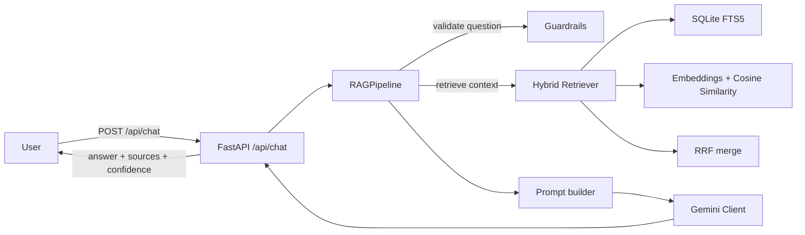

# Interdimensional Oracle

A Retrieval-Augmented Generation (RAG) chatbot that answers questions about the Rick and Morty universe using a Gemini-based LLM layer.

---

## Architecture



---

## Why hybrid retrieval?

This project uses **hybrid retrieval** because each method compensates for the other's weaknesses:

- **Semantic (embeddings + cosine similarity)**
  - Helps when the wording in the question doesn’t match the document text closely.
- **Lexical (SQLite FTS5 keyword search)**
  - Helps when the question contains specific names/terms (“Rick”, “Citadel of Ricks”, etc.).
- **RRF (Reciprocal Rank Fusion)**
  - Combines both ranked lists into a single robust ordering without needing a hard weighting/tuning upfront.

---

## Retrieval Strategy

The application uses a hybrid retrieval approach:

1. **SQLite FTS5** for exact keyword matching (character names, episode codes, locations).
2. **Sentence-Transformers (all-MiniLM-L6-v2)** for semantic similarity over precomputed embeddings.
3. **Reciprocal Rank Fusion (RRF)** combines both ranked lists into the final result.

### Why this approach?

- **FTS5 is efficient** for exact entity lookup (names/titles).
- **Embeddings improve retrieval** for natural language phrasing and paraphrases.
- **RRF combines lexical + semantic rankings** without requiring complex score calibration.

For a dataset of ~1000 documents, **SQLite + local embeddings** provides a lightweight solution without requiring an external vector database.

---

## Setup instructions

### 1) Prerequisites
- Python 3.9+
- Internet access (required once for ingestion if you regenerate the knowledge base)

### 2) Gemini API key
Create a Gemini API key in **Google AI Studio**.

Create a `.env` file in `backend/` and set at minimum:

```env
LLM_PROVIDER=gemini
MODEL_NAME=gemini-2.5-flash
GOOGLE_API_KEY=your_api_key_here
```

> Note: the app loads `backend/.env` automatically at startup.

### 3) Knowledge base artefacts
Ensure these artefacts exist locally:
- `backend/data/oracle.db`
- `backend/data/embeddings.npy`
- `backend/data/embeddings.ids.json`


### 4) Run locally

```bash
python -m venv .venv
source .venv/bin/activate
pip install -r requirements.txt
uvicorn backend.app.main:app --reload --port 8000
```

Then open:
- `frontend/index.html`

The frontend is configured to talk to `http://127.0.0.1:8000`.

---

## Known limitations

- **Scope limited to the local Rick & Morty knowledge base** (from ingestion). If a question is outside the stored documents, retrieval may return nothing.
- **Retrieval quality depends on embeddings artefacts** being present and consistent with the stored DB.
- **No multi-turn conversation memory**: each request is independent.
- **FTS5 query behavior can vary by SQLite build/version** (handled safely in code, but it’s still SQLite-dependent).

---

## Future improvements

- **Dynamic browse mode backed by SQLite** (instead of static mock data).
- **Streaming responses** from Gemini.
- **Conversation memory** (session-based chat history + summarization).
- **Cross-encoder re-ranking** for higher precision after the hybrid retrieval step.
- **Docker deployment** (pin python/OS deps + simplify local setup).
- **Automated testing** (API contract tests + retrieval smoke tests).
- Add observability: request IDs, structured logging, and retrieval debug endpoints.


